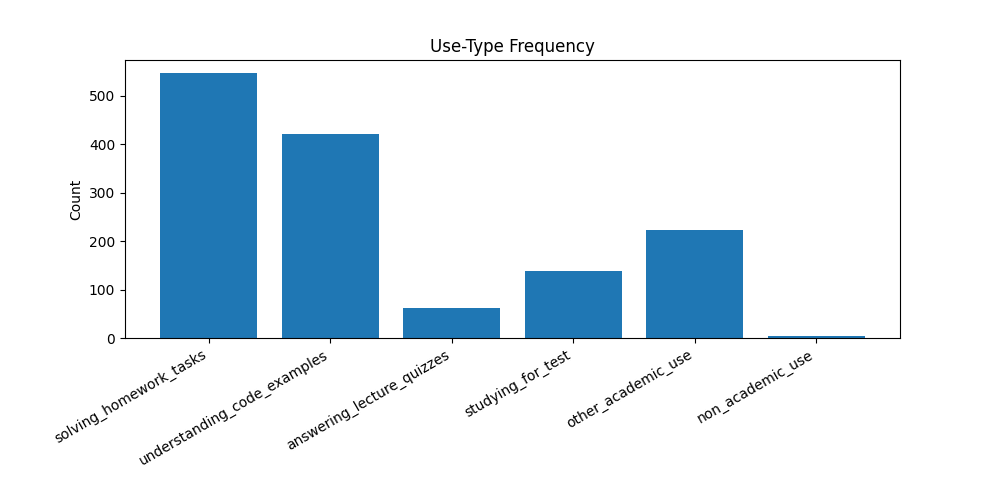
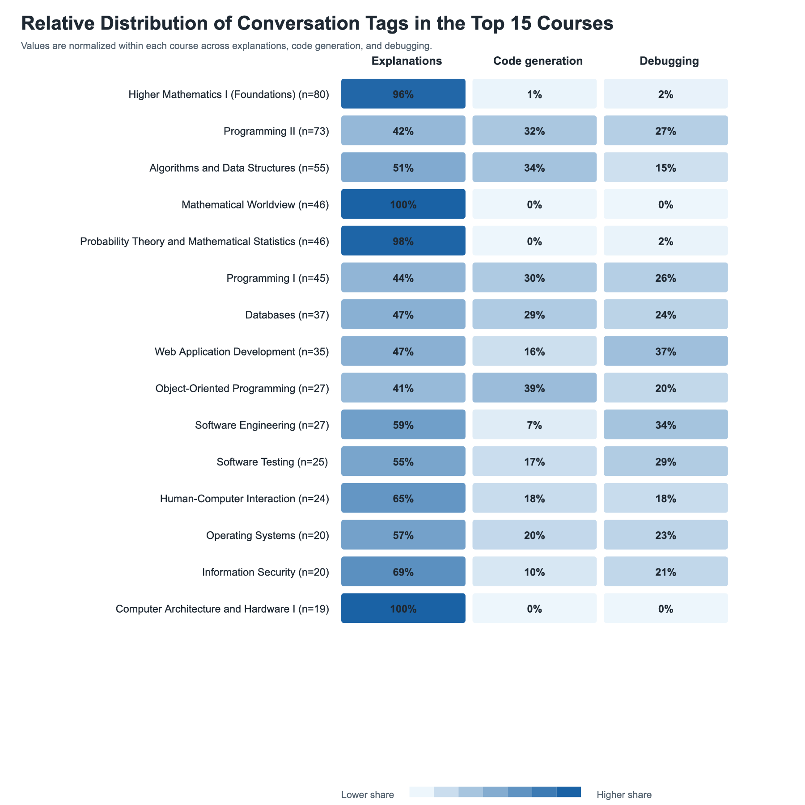

# chatlog-classifier

A pipeline that takes a ChatGPT data export, decides which conversations are
about university studies, and uses the OpenAI API to label each one with its
course, the kind of help requested and the sentiment. The output is structured
JSON that feeds a set of counting and plotting scripts.

I built it for my bachelor's thesis (University of Tartu, 2026), where I
analysed two years of my own ChatGPT use: 1,660 conversations, of which 702
turned out to be study-related. The full write-up is in
[docs/Parsim_Informaatika_2026.pdf](docs/Parsim_Informaatika_2026.pdf).

## The problem

A ChatGPT export is one large JSON file in which homework help, exam
preparation, cooking recipes and gift ideas all sit together. Answering "which
courses did I use it for, and how?" needs every conversation read and labelled.
By hand that is not practical at this size, and keyword matching alone is too
coarse. This tool uses an LLM for the judgement calls and keeps everything
else as plain, inspectable JSON files.

## Pipeline

```
conversations.json  (ChatGPT export)
        |
        v
[1] keyword pre-filter        optional, offline           01_filter_keywords.py
        |
        v
[2] LLM classification        relevance, domain,          02_classify.py
        |                     use types (OpenAI)
        v
[3] split by relevance        relevant / irrelevant       03_split_by_relevance.py
        |
        v
[4] LLM enrichment            sentiment, tags,            04_enrich.py
        |                     matched course (OpenAI)
        v
structured JSON  ->  analysis/  (counts, per-course summaries)
                 ->  plots/     (charts, heatmap)
```

| Stage | Input | Output | Uses API |
|---|---|---|---|
| 1. Filter | export | `matched.json`, `unmatched.json`, `report.csv` | no |
| 2. Classify | export | `classified_conversations.json` | yes |
| 3. Split | classified conversations | `classified_relevant.json`, `classified_irrelevant.json` | no |
| 4. Enrich | relevant set, export, `config/courses.csv` | `classified_relevant_enriched.json` | yes |
| Analysis, plots | enriched JSON | summary JSON/CSV, PNG/SVG charts | no |

Details worth knowing:

- **Stage 1 is optional.** It scores conversations by English and Estonian
  programming and study keywords, with optional exclusion lists. It is cheap
  but low-recall on short chats: on the bundled sample it passes only 2 of 9
  academic conversations at the default threshold. For the thesis I skipped it
  and classified all conversations. If you use its output as input to stage 2,
  pass the same file as `--conversations` to the later stages, because they
  look conversations up by list index.
- **Stage 2** sends each whole conversation to the model and asks for a fixed
  JSON schema (below). Results are written after every conversation, so an
  interrupted run resumes where it stopped. Conversations too large for the
  model's context window fail and are skipped (8 of 1,660 in my run).
- **Stage 4** only offers the model courses whose semester window contains the
  conversation date, which keeps the matching problem small. Only the user's
  messages are sent, and long ones are cut to head and tail
  (`--max-chars`, default 12,000).
- A full stage 2 run over 1,660 conversations with `gpt-5-mini` took about four
  hours and cost about $6.72.

## Tech stack

Python 3.10+, the OpenAI Python SDK (Responses API, default model
`gpt-5-mini`), matplotlib and numpy. No database: every stage reads and writes
JSON or CSV files, so any intermediate result can be inspected or edited.

## Running it

```bash
python -m venv .venv && source .venv/bin/activate
pip install -r requirements.txt
```

### Without an API key (sample data)

`examples/output/` holds pre-computed stage 2 and 4 output for the sample, so
the offline stages can be run directly:

```bash
python src/chatlog_classifier/03_split_by_relevance.py --input examples/output/classified_conversations.json
python src/chatlog_classifier/analysis/use_type_counts.py
python src/chatlog_classifier/analysis/course_tag_summary.py --input examples/output/classified_relevant_enriched.json
python src/chatlog_classifier/analysis/prompt_stats.py --conversations examples/conversations.sample.json
python src/chatlog_classifier/plots/course_tag_heatmap.py
python src/chatlog_classifier/plots/prompt_stats.py --conversations examples/conversations.sample.json
```

Results go to `outputs/` (gitignored).

### With an API key (sample data)

```bash
export OPENAI_API_KEY=your-key-here
python src/chatlog_classifier/02_classify.py --input examples/conversations.sample.json
python src/chatlog_classifier/03_split_by_relevance.py
python src/chatlog_classifier/04_enrich.py --conversations examples/conversations.sample.json
```

### With your own export

Request your data from ChatGPT (Settings, Data controls, Export), unzip it, and
put `conversations.json` in `data/`. Copy `config/courses.example.csv` to
`config/courses.csv` and list your own courses with their semester dates (an
optional `name_en` column gives the heatmap English display names). Then run
stages 2 to 4 without the `--input` and `--conversations` flags, and pass
`--courses config/courses.csv` to `04_enrich.py` and
`plots/course_tag_heatmap.py`. Every script accepts `--help`.

## Example

The sample in `examples/conversations.sample.json` is synthetic: 11 invented
conversations in the ChatGPT export format. The files in `examples/output/`
were written by hand to show the schema the model returns; they are not real
model output. The offline stages above run on them for real.

Input, one conversation (simplified; the export stores messages as a `mapping` tree):

```json
{
  "title": "Binary search tree insert",
  "create_time": 1741701600.0,
  "messages": [
    {"role": "user", "text": "Write an insert method for a binary search tree in Java. It is for assignment 2 in the data structures course."},
    {"role": "assistant", "text": "Here is a recursive insert(Node node, int value) ..."},
    {"role": "user", "text": "It throws a NullPointerException when the tree is empty. ..."}
  ]
}
```

Output of stage 2:

```json
{
  "relevance": "relevant_to_university_studies",
  "domain": ["programming"],
  "use_types": ["solving_homework_tasks"],
  "discard_reason": null,
  "notes": "Assignment code generation followed by debugging a null-pointer error.",
  "index": 4,
  "title": "Binary search tree insert"
}
```

Stage 4 adds sentiment, tags and the matched course:

```json
{
  "sentiment": "neutral",
  "tags": ["Code generation", "debugging"],
  "matched_courses": [
    {
      "course_code": "CS201",
      "course_name": "Data Structures and Algorithms",
      "course_description": "Lists, trees, graphs, sorting, complexity analysis.",
      "semester_start": "2025-02-01",
      "semester_end": "2025-06-15"
    }
  ]
}
```

Allowed values:

- `relevance`: `relevant_to_university_studies`, `mixed`, `personal_irrelevant`
- `domain`: `programming`, `math`, `other`
- `use_types`: `solving_homework_tasks`, `understanding_code_examples`,
  `studying_for_test`, `answering_lecture_quizzes`, `other_academic_use`,
  `non_academic_use`
- `sentiment`: `positive`, `neutral`, `negative`, `mixed`
- `tags`: `Code generation`, `debugging`, `explanations`

The analysis scripts turn the enriched file into per-course summaries, for
example `course_tag_summary.py` on the sample:

| Course | Conversations | Debugging | Code generation | Explanations |
|---|---|---|---|---|
| CS210 Databases | 3 | 1 | 0 | 2 |
| CS101 Introduction to Programming | 2 | 1 | 0 | 2 |
| CS201 Data Structures and Algorithms | 2 | 1 | 1 | 1 |

## Results on the real data

`results/` holds aggregate outputs from my own run: counts, per-course
summaries and charts. The conversations themselves are not included.





## Repository layout

```
src/chatlog_classifier/   pipeline stages 01-04, analysis/, plots/
config/                   example course list, keyword and title exclusion lists
examples/                 synthetic sample input and illustrative output
results/                  aggregate charts and summaries from the thesis run
docs/                     the thesis PDF
```

## Limitations

- The labels come from an LLM and are not checked against human labels in this
  repository.
- The input format is the ChatGPT data export. Other chatbot logs would need a
  small adapter that produces the same `mapping` structure.
- The course list is supplied by the user, and matching relies on conversation
  dates falling inside the semester windows you give it.
- The data comes from one student, so the results describe one person's usage.

## Privacy

The raw export, the classification outputs and any API keys are excluded by
`.gitignore` (`data/`, `outputs/`, `.env`, `classified_*.json`). Do not commit
your own export.

## Licence

The code is MIT-licensed, see [LICENSE](LICENSE). The thesis PDF in `docs/` is
made available by the University of Tartu under CC BY-NC-ND 4.0.
